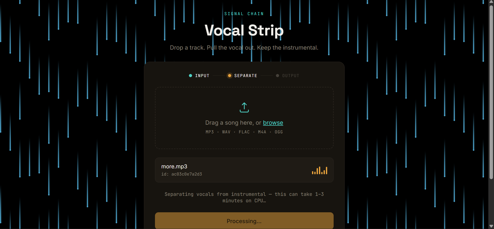

<div align="center">

# 🎚️ VoxStrip

**Strip the vocals. Keep the sound.**

Ekstraksi instrumental dari lagu secara lokal, berbasis AI source separation — tanpa upload ke layanan pihak ketiga.

[](https://www.python.org/)
[](https://fastapi.tiangolo.com/)
[](https://github.com/facebookresearch/demucs)
[](https://pytorch.org/)
[](LICENSE)

</div>

---

## 📖 Tentang

**VoxStrip** adalah aplikasi web sederhana untuk memisahkan **vokal** dari **instrumental** pada sebuah lagu. Cukup unggah file audio, dan aplikasi akan memproses lagu tersebut menggunakan model AI **[Demucs v4](https://github.com/facebookresearch/demucs)** (dikembangkan oleh Meta AI Research) untuk menghasilkan versi instrumental — vokal dibuang, musik tetap utuh.

Seluruh proses berjalan **100% lokal di komputer/server sendiri** (CPU maupun GPU), tanpa mengirim file audio ke API atau layanan cloud pihak ketiga. Cocok digunakan untuk membuat karaoke track, backing track latihan, sample produksi musik, maupun keperluan riset audio processing.

### ✨ Fitur

- 🎵 **Drag & drop upload** — cukup seret file audio ke browser
- 🧠 **AI source separation** dengan model Demucs (`htdemucs`)
- ⚙️ **Background processing** — proses berat berjalan di belakang layar tanpa nge-freeze browser
- 📊 **Real-time status polling** — pantau progres dari "queued" sampai "done"
- ⬇️ **Download langsung** hasil instrumental dalam format WAV
- 🖥️ Antarmuka web ringan berbasis Jinja2 + vanilla JS (tanpa framework frontend berat)

---

## 🖼️ Tampilan Aplikasi

<div align="center">
  
</div>

---

## 🛠️ Tech Stack

| Layer | Teknologi |
|---|---|
| Backend | FastAPI, Uvicorn |
| Audio Separation | Demucs v4 (`htdemucs`), PyTorch, Torchaudio |
| Audio Utility | Pydub, Soundfile, FFmpeg |
| Frontend | HTML, CSS, Vanilla JavaScript, Jinja2 Templates |

---

## 📦 Instalasi

### Prasyarat

- Python 3.10 – 3.12
- [FFmpeg](https://ffmpeg.org/download.html) sudah terpasang dan terdaftar di PATH
- Git (opsional, untuk clone repository)

### Langkah instalasi

```bash
# 1. Clone repository
git clone https://github.com/username/voxstrip.git
cd voxstrip

# 2. Buat dan aktifkan virtual environment
python -m venv venv

# Windows
venv\Scripts\activate

# macOS / Linux
source venv/bin/activate

# 3. Install dependency dasar
pip install -r requirements.txt

# 4. Install PyTorch versi CPU (khusus untuk komputer tanpa GPU NVIDIA)
pip install torch==2.4.1 torchaudio==2.4.1 --index-url https://download.pytorch.org/whl/cpu
```

> **Catatan:** Jika komputer memiliki GPU NVIDIA (CUDA), lewati langkah 4 dan install PyTorch versi CUDA sesuai panduan resmi di [pytorch.org](https://pytorch.org/get-started/locally/) untuk mempercepat proses separasi secara signifikan.

### Menjalankan aplikasi

```bash
uvicorn main:app --reload
```

Buka browser dan akses:

```
http://127.0.0.1:8000
```

---

## 🚀 Cara Penggunaan

1. **Buka aplikasi** di browser melalui `http://127.0.0.1:8000`
2. **Seret (drag) file lagu** ke area upload, atau klik untuk memilih file secara manual
   - Format yang didukung: `.mp3` `.wav` `.flac` `.m4a` `.ogg`
3. Klik tombol **"Upload track"** — file akan tersalin ke folder `uploads/`
4. Setelah upload berhasil, klik tombol **"Strip vocals"** untuk memulai proses pemisahan vokal
5. Tunggu proses berjalan (indikator equalizer akan menyala selama proses berlangsung)
   - Estimasi waktu: **1–3 menit per lagu** pada CPU, jauh lebih cepat dengan GPU
6. Setelah status berubah menjadi **"Done"**, klik tombol **"Download instrumental"** untuk mengunduh hasilnya

Hasil akhir tersimpan di folder `hasil/htdemucs/{nama_file}/no_vocals.wav`.

---

## 📁 Struktur Proyek

```
voxstrip/
├── main.py                  # Entry point FastAPI, routing endpoint
├── requirements.txt
├── templates/
│   └── index.html           # Halaman utama aplikasi
├── static/
│   ├── css/style.css
│   └── js/main.js
├── processor/
│   ├── filter_audio.py      # Logic pemanggilan Demucs
│   └── utils.py             # Fungsi bantu (validasi, ID unik)
├── uploads/                 # File audio yang diupload user
└── hasil/                   # Hasil pemisahan vokal/instrumental
```

---

## ⚠️ Batasan

- Kualitas separasi tergantung pada karakteristik lagu (kepadatan mix, genre, kualitas rekaman) — hasil terbaik umumnya didapat dari mixing musik modern/studio.
- Belum ada antrean multi-user; satu proses separasi berjalan pada satu waktu per instance server.
- Waktu proses di CPU relatif lama untuk lagu berdurasi panjang; disarankan menggunakan GPU untuk penggunaan produksi.

---

## 📄 Lisensi

Proyek ini dirilis di bawah lisensi **[MIT](LICENSE)** — bebas digunakan, dimodifikasi, dan didistribusikan untuk keperluan pribadi maupun komersial, dengan tetap mencantumkan atribusi.

---

<div align="center">

Dibangun dengan FastAPI, PyTorch, dan Demucs.

</div>